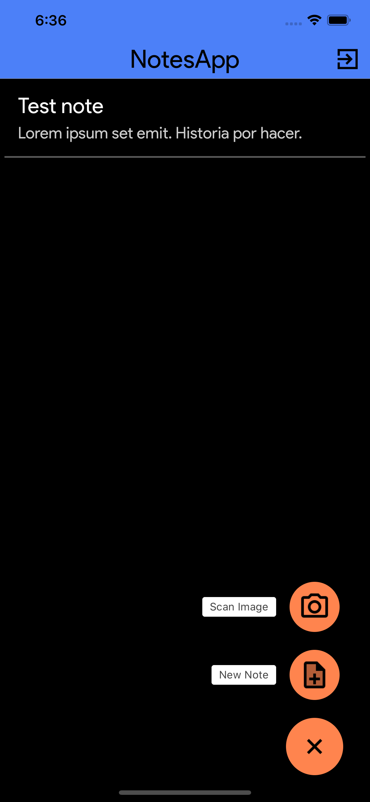
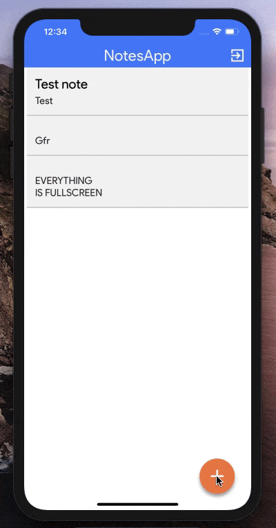

# NotesApp


A React Native Application to take notes.
This is a simple application I created to take notes in React Native.
Made using [`this`](https://www.github.com/abhisheknairofficial/react-native-boilerplate) template.

Take notes, get notes from images, share them with others, save them to your account with this app. Here are a few screenshots and a gif showing it in action.






## Features

---

1. Sign-in with google, and access data across multiple devices.
2. Ability to take down notes and store them.
3. Notes are backed up using Firebase, so data is always safe even if the device has an issue.
4. Data encryption enabled, so it is only visible on the device.
5. Ability to scan images and convert them to text notes.
6. Dark more support.

## Installation

---

1. Run `yarn` to install the packages listed in the package.json.

2. (For iOS) Go into iOS folder, and run `pod install`. This is a necessary step for running in iOS.

## Running the App for development

Android

```sh
yarn run-android
```

iOS

```sh
yarn run-ios
```

## Installing a working APK in your device

1. Run this command:

   ```sh
   yarn build-android
   ```

2. Next:

   ```sh
   cd android
   #Create debug build:
   $ ./gradlew assembleDebug
   #Create release build:
   $ ./gradlew assembleRelease
   #Generated `apk` will be located at `android/app/build/outputs/apk`
   ```

## Sources

---

1. Using [`use-global-hook`]('https://medium.com/javascript-in-plain-english/state-management-with-react-hooks-no-redux-or-context-api-8b3035ceecf8) for State management.

2. [`Firebase ML`](https://firebase.google.com/products/ml-kit) for text recogntion.

3. [`Medium Article on the app`](https://medium.com/@abhisheknairp/notesapp-b443bb9b2ac9)

4. [`Medium Article on ML`](https://medium.com/@abhisheknairp/machine-learning-now-for-javascript-bois-76a62aaffbb7)

## Todo

---

1. Implement Task updates / checkbox

2. Add image upload support.
